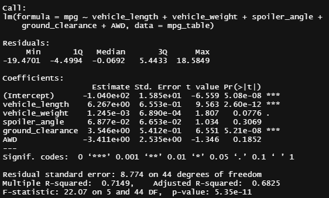
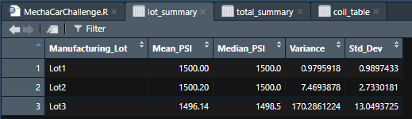
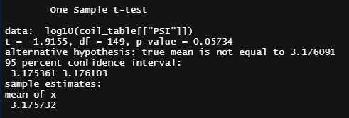
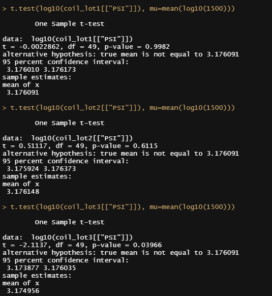

# MechaCar_Statistical_Analysis

## Linear Regression to Predict MPG

* *Which variables/coefficients provided a non-random amount of variance to the mpg values in the dataset?*  
  Vehicle length, ground clearance (as well as intercept) provided a non-random amount of variance to the mpg values in the dataset. This means that the vehicle length and ground clearance have a significant impact on the mpg, compared to AWD, spoiler angle and vehicle weight where those variables' p-values are greater than our assumed significance level of 0.05- which means they are most likely to contribute a random variance to the mpg values.
  
* *Is the slope of the linear model considered to be zero? Why or why not?*  
  The slope of the linear model is not considered to be 0 because our p-value is 5.35 x 10^-11, which is much smaller than our significance level of 0.05%.
  
 * *Does this linear model predict mpg of MechaCar prototypes effectively? Why or why not?*  
  Yes, this linear model predicts mpg values of MechaCar prototypes pretty effectively; which means that ~71.5% of all mpg predictions will be correct based on the variables provided or at least one fo the independent variables provided.
  
 ## Summary Statistics on Suspension Coils
 ### Overall Summary
 
 
 ### Summary by Lot number
 
  
 * *The design specifications for the MechaCar suspension coils dictate that the variance of the suspension coils must not exceed 100 pounds per square inch. Does the current manufacturing data meet this design specification for all manufacturing lots in total and each lot individually? Why or why not?*  
If we were to look at all the lots holistically, yes, the suspension coils meet the design specifications since the variance is under 100 pounts per square inch. But based on the second image above, we note that Lot #3 has a variance of 170.3 pounds, which is greater than the design spec.

## T-Tests on Suspension Coils
### All lots t-test

### T-test per Lot

 * *Briefly summarize your interpretation and findings for the t-test results.*
The p-values for the lots altogether are above our assumed significance level of 0.05%, which means that we do not have sufficient evidence to reject our null hypothesis that states that there is no statistical difference between the mean of all the lots and the population mean of 1,500 lbs.

However, when we calculate the one-sample t-test for each lot individually, we can see that the p-value for lot #3 only is less than 0.05%, which means that we accept our alternate hypothesis that there is indeed a statistical difference between the mean of lot #3 and the population mean of 1,500 lbs.

